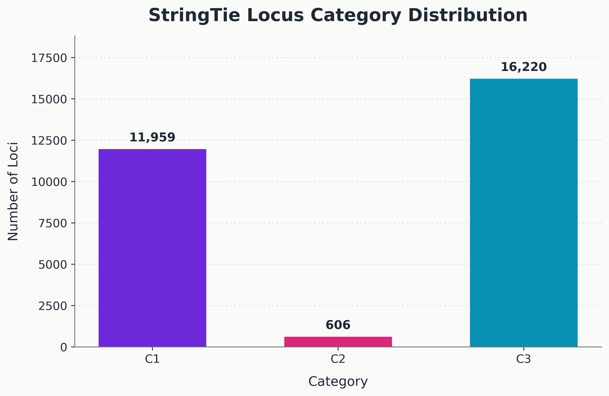

# RNA-Seq Transcriptome Analysis of *Gallus gallus*

**Author:** Hera Dashnyam  
Bioinformatics • Spatial Data Science • Miami University  

This project analyzes RNA-Seq assembled transcripts from the chicken genome and compares them with the reference genome annotation to identify novel genes and transcript isoforms.

Using transcriptome assembly results generated by **StringTie**, genomic interval intersection analysis was performed using **pybedtools** to classify transcript loci based on their overlap with known reference genes.

---

## Research Question

RNA-Seq transcriptome assembly often reconstructs transcripts that are absent from the reference genome annotation. This project investigates:

- How assembled transcripts relate to existing gene annotations  
- Whether novel gene loci exist in intergenic regions  
- Whether new transcript isoforms appear within known genes  

The goal is to systematically classify assembled transcripts relative to the reference annotation.

---

## Dataset

Reference genome annotation:

bGalGal1.mat.broiler.GRCg7b.annotation.gtf

RNA-Seq transcriptome assembly:

YapPool_merge.gtf

Species:

Gallus gallus (chicken)

---

## Analysis Pipeline

The workflow integrates transcriptome assembly with genomic interval analysis.

RNA-Seq Reads
↓
Genome Alignment
↓
Transcript Assembly (StringTie)
↓
GTF Parsing
↓
pybedtools Intersection Analysis
↓
Transcript Classification
↓
Gene-level Summaries + IGV Validation

Key steps performed in the pipeline:

1. Parse reference genome annotations  
2. Parse RNA-Seq assembled transcripts  
3. Convert genomic intervals into **pybedtools objects**  
4. Perform transcript–gene intersection analysis  
5. Assign transcript categories based on overlap patterns  
6. Cluster transcripts into loci  
7. Generate gene-level summaries  
8. Export IGV visualization tracks for validation

---

## Transcript Classification

Assembled transcripts are classified into three categories based on their relationship to reference genes.

| Category | Description |
|--------|-------------|
| **C1** | Novel gene locus located in intergenic regions with no overlap with reference genes |
| **C2** | Novel gene locus overlapping existing gene isoforms |
| **C3** | Known gene with newly discovered transcript isoforms |

These classifications help identify candidate novel genomic features revealed by RNA-Seq assembly.

---

## Example Visualization

### Transcript Category Distribution

---

### Transcript Span Distribution

---

### Example IGV Validation

Candidate loci were manually inspected in **Integrative Genomics Viewer (IGV)** to validate transcript structures.

---

## Repository Structure

rnaseq-transcriptome-analysis
│
├── notebooks
│ └── transcript_overlap_analysis.ipynb
│
├── scripts
│ └── transcript_classification_pipeline.py
│
├── results
│ ├── gene_comparison_unified.csv
│ ├── stringtie_gene_summary.csv
│ └── assembled_transcripts_sample.csv
│
├── igv_tracks
│ ├── loci_C1.bed
│ ├── loci_C2.bed
│ └── loci_C3.bed
│
└── reference_data
└── reference_gene_classes_all.csv

---

## Tools and Technologies

Bioinformatics tools used in this project:

- **HISAT2** – RNA-Seq alignment  
- **StringTie** – transcriptome assembly  
- **pybedtools** – genomic interval operations  
- **bedtools** – genomic intersection analysis  
- **Python** – data processing and pipeline development  
- **Jupyter Notebook** – reproducible research workflow  
- **IGV** – transcript structure validation

---

## Results Summary

The analysis revealed multiple transcript classes relative to the reference genome annotation.

Key observations:

- Large number of assembled transcripts overlapping existing gene loci  
- Identification of candidate **novel gene loci (C1)** in intergenic regions  
- Substantial transcript diversity within several loci  
- Variation in exon counts and transcript lengths across assembled transcripts

IGV validation tracks were generated to enable manual inspection of transcript structures.

---

## Reproducibility

The full analysis workflow is provided in:

notebooks/transcript_overlap_analysis.ipynb

The notebook documents the complete pipeline used to parse genomic annotations, perform intersection analysis, and generate summary outputs.

---

## Author

Hera Dashnyam  
Data Analytics (Bioinformatics) and Environmental Science  
Miami University

GitHub: https://github.com/MaralguaDashnyam
