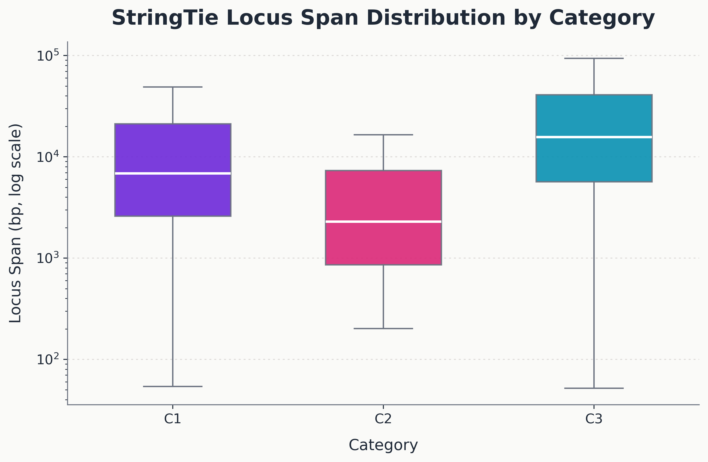
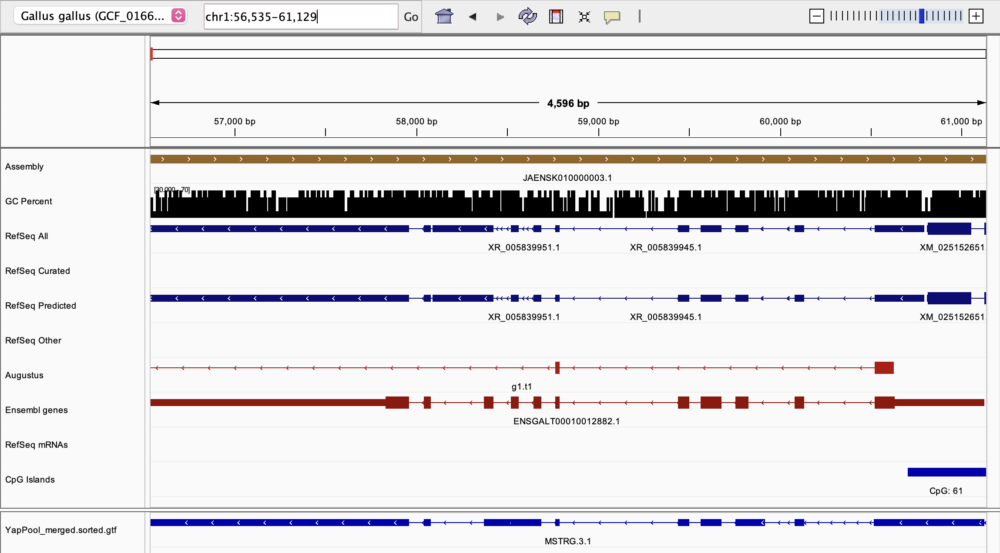
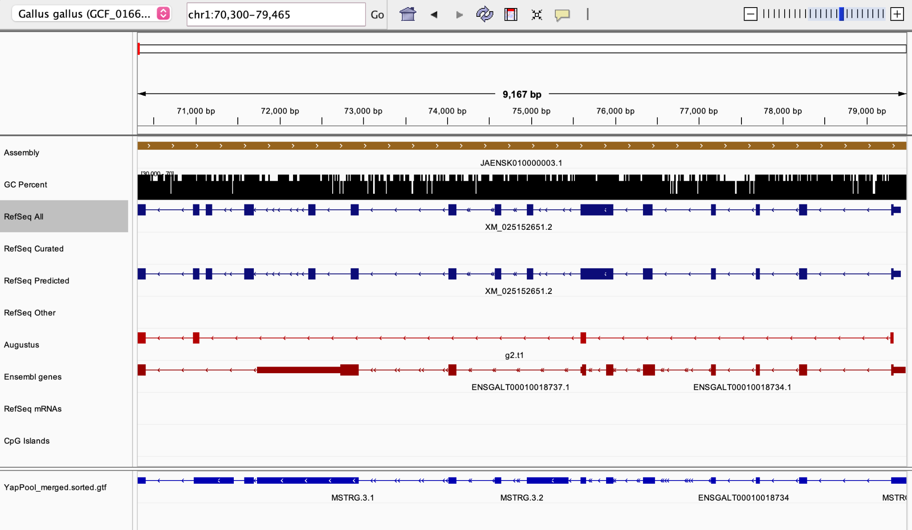
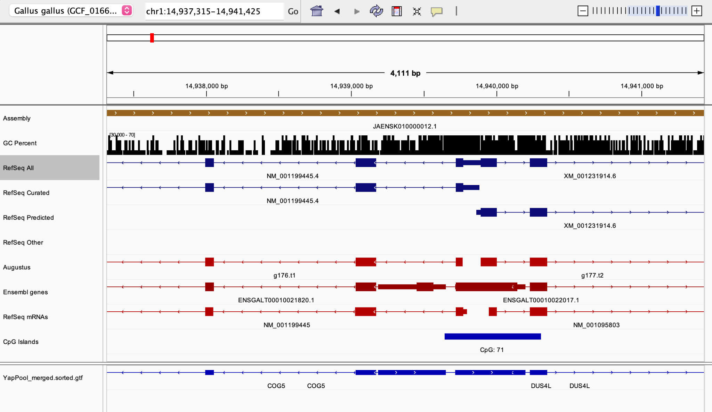

# RNA-Seq Transcriptome Analysis of *Gallus gallus*

**Author:** Hera Dashnyam
Bioinformatics • Spatial Data Science • Miami University

This project analyzes RNA-Seq–assembled transcripts from the chicken genome to identify and characterize novel gene loci and transcript isoforms relative to the reference genome annotation.

Using transcriptome assembly results generated by **StringTie**, genomic interval intersection analysis was performed using **pybedtools** to classify transcript loci based on their overlap with known reference genes.

---

## Research Question

RNA-Seq transcriptome assembly often reconstructs transcripts that are absent from the reference genome annotation. This project investigates:

* How assembled transcripts relate to existing gene annotations
* Whether novel gene loci exist in intergenic regions
* Whether new transcript isoforms appear within known genes

The goal is to systematically classify assembled transcripts relative to the reference annotation.

---

## Dataset

Reference genome annotation:
`bGalGal1.mat.broiler.GRCg7b.annotation.gtf`

RNA-Seq transcriptome assembly:
`YapPool_merge.gtf`

Species:
*Gallus gallus* (chicken)

> Raw reference and assembly files are not included due to file size. This repository focuses on the analysis workflow, processed outputs, and visualization results.

---

## Analysis Pipeline

RNA-Seq Reads
↓
Genome Alignment
↓
Transcript Assembly (StringTie)
↓
GTF Parsing
↓
pybedtools Intersection Analysis
↓
Transcript Classification
↓
Gene-level Summaries + IGV Validation

Key steps:

1. Parse reference genome annotations
2. Parse assembled transcripts
3. Perform genomic interval intersections using pybedtools
4. Assign transcript categories based on overlap patterns
5. Cluster transcripts into loci
6. Generate gene-level summaries
7. Export IGV tracks for validation

---

## Transcript Classification

| Category | Description                                           |
| -------- | ----------------------------------------------------- |
| **C1**   | Novel gene locus with no overlap with reference genes |
| **C2**   | Novel gene locus overlapping reference isoforms       |
| **C3**   | Known gene with newly identified transcript isoforms  |

---

## Example Visualization

### StringTie Locus Category Distribution


---

### StringTie Locus Span Distribution (Log Scale)



---

## IGV-Based Structural Validation

Representative loci were manually inspected in **Integrative Genomics Viewer (IGV)** to validate transcript structures and classification results.

### Known Gene with Novel Isoform (C3)



A StringTie-assembled transcript closely matches the structure of a known Ensembl gene, supporting classification as a **novel isoform (C3)**.

---

### Multiple Isoforms Within a Gene Locus



Multiple assembled transcripts align to a single gene locus with varying exon boundaries, highlighting **alternative splicing and transcript diversity**.

---

### Extended or Readthrough Transcript



A transcript spans multiple annotated regions, suggesting a **readthrough event or extended transcript structure** not captured in existing annotations.

---

## Repository Structure

```
rnaseq-transcriptome-analysis
│
├── notebooks
│   └── transcript_overlap_analysis.ipynb
│
├── scripts
│   └── transcript_classification_pipeline.py
│
├── results
│   ├── gene_comparison_unified.csv
│   ├── stringtie_gene_summary.csv
│   └── assembled_transcripts_sample.csv
│
├── igv_tracks
│   ├── loci_C1.bed
│   ├── loci_C2.bed
│   └── loci_C3.bed
│
├── figures
│   ├── category_distribution.png
│   ├── span_distribution_log.png
│   ├── igv_c3_isoform.png
│   ├── igv_multi_isoform.png
│   └── igv_readthrough.png
│
└── reference_data
    └── reference_gene_classes_all.csv
```

---

## Tools and Technologies

* **HISAT2** – RNA-Seq alignment
* **StringTie** – transcriptome assembly
* **pybedtools / bedtools** – genomic interval analysis
* **Python** – data processing
* **Jupyter Notebook** – reproducible workflow
* **IGV** – structural validation

---

## Results Summary

* Substantial number of loci correspond to **existing genes with novel isoforms (C3)**
* Identification of **candidate novel loci (C1)** in intergenic regions
* Evidence of **alternative splicing and transcript diversity**
* Detection of **extended and readthrough transcript structures**

---

## Reproducibility

Full workflow:

`notebooks/transcript_overlap_analysis.ipynb`

---

## Author

Hera Dashnyam
Data Analytics (Bioinformatics) and Environmental Science
Miami University

GitHub: https://github.com/MaralguaDashnyam
